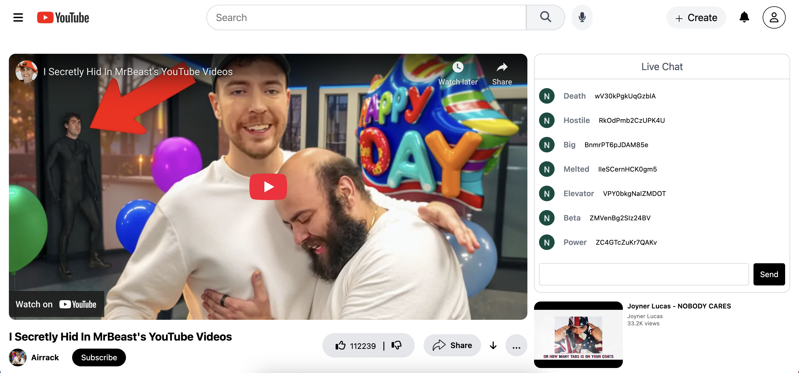

# YouTube Clone (React + Redux + Tailwind)

This is a **YouTube Clone** built with **React**, **Redux**, and **Tailwind CSS**. It uses the **YouTube Data API v3** to fetch trending videos, display search results, and simulate a YouTube-like browsing experience.

**Live Demo:** [fir-ad80a.web.app](https://fir-ad80a.web.app/)  
**GitHub Repo:** [github.com/summbal122/Youtube](https://github.com/summbal122/Youtube)

---

##  Features

-  Real-time search
-  Trending videos on homepage
-  Caching with Redux for performance
-  Responsive design with Tailwind
-  Clean code structure using components
-  Debounced API calls to reduce quota usage

---

## 🛠️ Tech Stack

- **React**
- **Redux Toolkit**
- **React Router DOM**
- **Tailwind CSS**
- **YouTube Data API v3**
- **Firebase Hosting**
- **Parcel (Build Tool)**

---

## Installation

To run this project locally:

```bash
git clone https://github.com/summbal122/Youtube.git
cd Youtube

npm install
npm run start 
```
___

## App Screenshots

### Larger Screen View

These screenshots show how the app looks on desktop or laptop devices:

<p>
  
  <br />
  
  <br />
  
  <br />
  
  <br />
  
</p>

---

### 📱 Mobile View

These screenshots show how the app adapts to mobile screen sizes:

<p>
  
  <br />
  
  <br />
  
</p>

